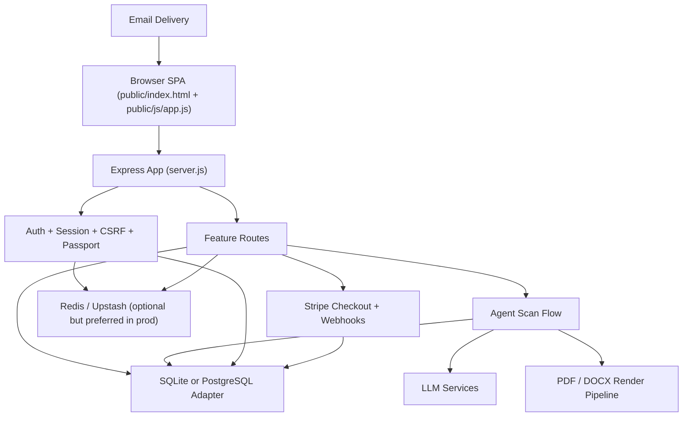
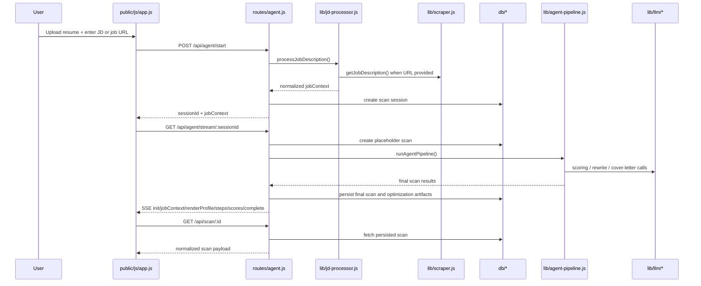

# ResumeXray Technical Documentation

This document is the engineering reference for the current ResumeXray codebase. It is written against the active SPA-plus-Express architecture in this repository and is intended to explain:

- what the product does end to end
- how requests move through the system
- how frontend, backend, AI, rendering, persistence, billing, and security layers connect
- which files own which concerns
- which top-level functions and routes exist in the first-party codebase
- what operational constraints and current risks matter to maintainers

Scope note:

- This document covers the first-party source of truth in `server.js`, `config/`, `middleware/`, `routes/`, `lib/`, `db/`, `public/`, `tests/`, and the active deployment/configuration files.
- Generated assets in `dist/` are mentioned as deployment artifacts, not as the editable source of truth.
- Minified/vendor code such as `public/js/purify.min.js` is not line-annotated here because it is not authored project logic.

## 1. Product Purpose

ResumeXray is an ATS-oriented resume workflow product. The core promise is:

1. User uploads an existing resume.
2. User supplies either a job description or a job URL.
3. The server resolves job context, including company, job title, job text, and ATS portal when possible.
4. The analysis pipeline parses the resume, evaluates ATS structure and keyword fit, and generates optimization artifacts.
5. The user previews ATS-oriented outputs before paying.
6. Credits are consumed only when exporting the final resume or cover letter.

The product supports two major usage modes:

- `Guest mode`
  Preview-focused, limited daily scans, token-gated access to scan results and previews.
- `Authenticated mode`
  Saved history, dashboard/profile, credit-backed exports, OAuth or email/password access.

## 2. Current Source Of Truth

The repository currently has one active frontend and one active backend.

### Active frontend

- `/Users/ghasmir/Documents/agents/ats-resume-checker/public/index.html`
- `/Users/ghasmir/Documents/agents/ats-resume-checker/public/js/app.js`
- `/Users/ghasmir/Documents/agents/ats-resume-checker/public/css/styles.css`
- `/Users/ghasmir/Documents/agents/ats-resume-checker/public/css/app-surfaces.css`

### Active backend

- `/Users/ghasmir/Documents/agents/ats-resume-checker/server.js`
- routes in `/Users/ghasmir/Documents/agents/ats-resume-checker/routes`
- business logic in `/Users/ghasmir/Documents/agents/ats-resume-checker/lib`
- persistence adapters in `/Users/ghasmir/Documents/agents/ats-resume-checker/db`

There is no second active frontend build pipeline anymore.

## 3. Runtime Architecture

## 4. Boot Sequence

The application boots in this order:

1. `server.js` loads environment variables with `dotenv`.
2. Sentry is initialized early through `lib/error-tracker.js`.
3. Express is created.
4. Trust proxy is enabled.
5. Database adapter is selected and initialized.
6. Graceful-shutdown handlers are registered.
7. Request ID, logging, Server-Timing, and shutdown-guard middleware are mounted.
8. CSP nonce middleware and helmet/security middleware are attached.
9. Compression and body parsers are mounted.
10. Session store is configured using SQLite or PostgreSQL.
11. Passport is configured and session middleware is enabled.
12. Static file serving from `public/` is attached.
13. CSRF token route is mounted.
14. CSRF protection middleware is mounted for state-changing routes.
15. Feature routes are mounted: auth, api, ai, agent, billing, user.
16. Health endpoints and error-report endpoints are mounted.
17. SPA catch-all serves `public/index.html` for app routes.

## 5. End-To-End User Flows

### 5.1 Guest or user opens the app

1. `server.js` serves `public/index.html`.
2. `public/js/app.js` runs on `DOMContentLoaded`.
3. `fetchUser()` requests `/user/me`.
4. The SPA router initializes and navigates based on current path and auth state.

### 5.2 User authentication

1. Frontend submits login/signup forms to `/auth/*`.
2. `routes/auth.js` validates, rate-limits, updates session, and claims guest scans when relevant.
3. `config/passport.js` handles OAuth strategies and session serialization.
4. Frontend calls `fetchUser()` again and rerenders nav/dashboard/profile state.

### 5.3 User runs a scan

### 5.4 User previews export

1. Frontend switches to Export Preview tab.
2. `reloadPdfPreview()` fetches `/api/agent/preview/:scanId`.
3. `routes/agent.js` calls `renderResumePdf()` in `lib/render-service.js`.
4. `renderResumePdf()` chooses the resume text source, ATS profile, template, and density, then calls `generatePDF()` in `lib/resume-builder.js`.
5. The backend returns a PDF buffer.
6. Frontend converts the PDF response to a blob URL and loads it into the iframe.

### 5.5 User exports

1. Frontend calls `/api/agent/download/:scanId?format=pdf|docx`.
2. `middleware/usage.js` enforces export credit requirements.
3. Backend renders the export and deducts credit atomically.
4. File downloads to the client.

## 6. Directory-Level Structure

### Root

- `server.js`
  Express application bootstrap and runtime wiring.
- `package.json`
  Scripts, dependencies, tooling commands.
- `README.md`
  Operator and developer overview.
- `FRONTEND_ARCHITECTURE.md`
  Frontend source-of-truth guidance.
- `project_history.md`
  Project ledger/history.
- `TECHNICAL_DOCUMENTATION.md`
  This document.
- `railway.json`
  Railway build/deploy entrypoint.
- `ecosystem.config.js`
  PM2 cluster/runtime config.
- `Caddyfile`, `infra/`, `deploy/`
  Infrastructure and deployment assets.

### `config/`

- Authentication, security/CSP/rate limiting, Stripe configuration.

### `middleware/`

- Auth gates, CSRF, uploads, usage/credit limits.

### `routes/`

- HTTP API surface grouped by feature.

### `lib/`

- Business logic and internal services:
  parser, analyzer, sections, xray, keywords, job context processing, LLM prompts/services, rendering, Redis, logging, error tracking, mailer.

### `db/`

- SQLite adapter
- PostgreSQL adapter
- schemas
- migrations
- seeds

### `public/`

- SPA shell, styles, client runtime, metadata/static assets.

### `tests/`

- Smoke tests, core flow tests, PDF/debug/manual test helpers.

## 7. Detailed Server Architecture

## 7.1 `server.js`

Responsibilities:

- environment load
- early Sentry init
- Express app creation
- security and middleware chain
- session store selection
- Passport session support
- static serving
- health and diagnostics endpoints
- route mounting
- SPA shell serving
- graceful shutdown

Important middleware layers in order:

1. request ID assignment
2. request logging
3. Server-Timing
4. shutdown guard
5. CSP nonce creation
6. helmet/security headers
7. permissions and clickjacking protection
8. general rate limiter
9. compression
10. Stripe raw-body webhook route
11. JSON/urlencoded parsers
12. session middleware
13. absolute session timeout middleware
14. Passport initialize/session
15. static serving
16. CSRF token route
17. CSRF protection
18. feature routes
19. health/metrics endpoints
20. CSP/client error sinks
21. SPA catch-all
22. centralized error handler

Primary top-level functions:

- `gracefulShutdown(signal)`
  Drains HTTP traffic, closes browser/Redis/db, and exits cleanly.
- `renderSpaShell(req, res, options)`
  Returns the SPA HTML shell for frontend routes.

## 7.2 Configuration Modules

### `config/passport.js`

Owns Passport strategy wiring and user session serialization.

Key behavior:

- configures Google, GitHub, and LinkedIn OAuth
- serializes only user ID into session
- deserializes users through db adapter
- supports account linking logic

Top-level function:

- `configurePassport()`

### `config/security.js`

Owns:

- helmet CSP
- permissions policy
- clickjacking headers
- Redis-backed or memory-backed rate limiters
- text sanitization helper

Key functions:

- `cspNonceMiddleware(req, res, next)`
- `configureHelmet()`
- `clickjackingProtection(req, res, next)`
- `permissionsPolicyMiddleware(req, res, next)`
- `buildRateLimitStore(prefix)`
- `keyByUserOrIp(req)`
- `makeLimiter(...)`
- `sanitizeInput(text)`

Important exports:

- `generalLimiter`, `authLimiter`, `apiLimiter`, `aiLimiter`, `agentLimiter`, `downloadLimiter`

### `config/stripe.js`

Owns Stripe client initialization and checkout session creation.

Key functions:

- `getStripe()`
- `createCheckoutSession(userId, email, packId)`

## 8. Middleware Layer

### `middleware/auth.js`

Auth and tier gates:

- `isAuthenticated`
- `isPro`
- `isExpert`
- `optionalAuth`

### `middleware/csrf.js`

Synchronizer-token CSRF protection.

Functions:

- `generateCsrfToken(req)`
- `getCsrfToken(req)`
- `csrfProtection(req, res, next)`

### `middleware/upload.js`

Multer configuration and upload-file validation.

Functions:

- `validateMagicBytes(buffer, mimetype)`

Exports:

- `upload`
- `ALLOWED_TYPES`
- `MAX_SIZE`

### `middleware/usage.js`

Usage gates for scans, AI features, and exports.

Functions:

- `checkScanLimit`
- `checkAiCredit`
- `checkExportCredit`
- `checkResumeLimit`

## 9. HTTP Route Surface

## 9.1 `routes/auth.js`

Responsibilities:

- signup
- login
- logout
- OAuth start/callback
- email verification
- resend verification
- forgot/reset password
- account linking
- login lockout state

Supporting functions:

- `checkLockout`
- `checkLockoutState`
- `recordFailedLogin`
- `recordFailedLoginState`
- `clearLoginAttempts`
- `clearLoginAttemptsState`
- `oauthCallbackHandler`

Primary endpoints:

- `POST /auth/signup`
- `POST /auth/login`
- `GET /auth/google`
- `GET /auth/github`
- `GET /auth/linkedin`
- `POST /auth/logout`
- `GET /auth/verify/:token`
- `POST /auth/resend-verification`
- `POST /auth/forgot-password`
- `POST /auth/reset-password`
- `POST /auth/link-account`

## 9.2 `routes/user.js`

Responsibilities:

- current user payload
- dashboard data
- credit history
- password update
- avatar update
- account deletion

Functions:

- `detectImageType(buffer)`

Endpoints:

- `GET /user/me`
- `GET /user/dashboard`
- `GET /user/credit-history`
- `PUT /user/password`
- `PUT /user/avatar`
- `DELETE /user/account`

## 9.3 `routes/billing.js`

Responsibilities:

- credit pack catalog
- current credits
- Stripe checkout
- Stripe webhook processing

Endpoints:

- `GET /billing/packs`
- `GET /billing/credits`
- `POST /billing/checkout`
- `POST /billing/webhook`

## 9.4 `routes/api.js`

Legacy/simple API endpoints outside the SSE agent workspace.

Endpoints:

- `POST /api/analyze`
- `GET /api/scan/:id`
- `POST /api/fix-bullet`

## 9.5 `routes/ai.js`

Feature endpoints for AI helpers.

Endpoints:

- `POST /ai/rewrite-bullet`
- `POST /ai/cover-letter`
- `POST /ai/interview-prep`
- `POST /ai/linkedin`

## 9.6 `routes/agent.js`

This is the core product route module.

Responsibilities:

- preflight job context resolution
- scan session creation
- SSE orchestration
- preview generation
- cover-letter preview
- download/export

Supporting functions:

- `parseScanId(raw)`
- `sendEmbeddedState(res, statusCode, payload)`
- `readJobContext(rawJobContext, fallback)`
- `buildSessionJobContext(dbSession)`
- `jobContextNeedsManualPaste(jobContext)`

Endpoints:

- `GET /api/agent/job-context`
  Resolves URL-derived or pasted-JD-derived `jobContext` before starting a scan.
- `POST /api/agent/start`
  Accepts upload + JD/link, creates a scan session, returns `sessionId` and `jobContext`.
- `GET /api/agent/stream/:sessionId`
  Runs the live analysis via SSE and persists placeholder/final scan state.
- `GET /api/agent/preview/:scanId`
  Returns inline preview PDF.
- `GET /api/agent/cover-letter-preview/:scanId`
  Returns preview HTML/PDF-ish cover-letter view.
- `GET /api/agent/download/:scanId`
  Generates downloadable export and charges credit.

## 10. Analysis Pipeline

## 10.1 `lib/agent-pipeline.js`

This is the orchestration engine for a live scan.

Function:

- `runAgentPipeline(resumeText, jdText, emitter, options)`

High-level steps:

1. sanitize resume text for LLM use
2. detect sections
3. run X-ray parser simulation
4. analyze formatting
5. score ATS/readiness
6. extract and match keywords
7. generate recommendations
8. optionally rewrite bullets
9. generate keyword plan
10. generate cover letter when JD exists
11. emit progress/tokens/scores to SSE
12. return final structured result bundle

## 10.2 Parsing, Sections, and Integrity

### `lib/parser.js`

Owns raw document parsing by file type.

Functions:

- `parseResume(buffer, mimetype)`
- `parsePDF(buffer)`
- `parseDOCX(buffer)`
- `parseTXT(buffer)`

### `lib/sections.js`

Owns heuristic structural section detection and integrity checks.

Functions:

- `detectSections(resumeText)`
- `detectContactInfo(text)`
- `analyzeFormat(resumeText)`
- `extractSections(text)`
- `extractContactInfo(text)`
- `validateResumeIntegrity(resumeText, sectionData)`

### `lib/resume-validator.js`

- `validateResumeContent(text)`
  Rejects obviously invalid uploads or non-resume content.

## 10.3 ATS Simulation and Diagnostics

### `lib/xray.js`

Owns parser emulation and extracted fields.

Functions:

- `runXrayAnalysis(rawText)`
- `simulateLegacyParser(text)`
- `simulateStructuredParser(text)`

### `lib/format-doctor.js`

- `checkFormatIssues(rawText, parsedSections)`
  Reports formatting and ATS-readability issues.

### `lib/analyzer.js`

- `analyzeResume(resumeText, jdText = '')`
  Higher-level combined analysis path.

### `lib/scorer.js`

- `generateRecommendations(keywordResults, xrayData, formatIssues)`
  Produces prioritized recommendation text.

## 10.4 Keywords and Matching

### `lib/keywords.js`

Functions:

- `extractKeywords(text)`
- `matchKeywords(resumeKeywords, jdKeywords)`
- `tokenize(text)`
- `findMultiWordSkills(text)`
- `expandTerms(termSet)`
- `fuzzyMatch(term, termSet)`
- `categorize(term)`

These functions support:

- exact keyword extraction
- phrase handling
- fuzzy matching
- categorization for missing/matched keywords

## 10.5 Job Description and ATS Context

### `lib/jd-processor.js`

This module makes job context server-owned and normalized.

Functions:

- `toTitleCase(value)`
- `cleanSlug(value)`
- `serializeTemplateProfile(atsProfile)`
- `hydrateAtsProfile(profileLike)`
- `detectATS(jobUrl, jdText, scrapePlatform)`
- `extractCompanyFromUrl(jobUrl)`
- `extractTitleFromUrl(jobUrl)`
- `extractJobTitleFromText(jdText)`
- `extractCompanyFromText(jdText, jobTitle)`
- `fallbackHostname(jobUrl)`
- `classifyScrapeStatus(errorMessage)`
- `normalizeJobContext(jobContext)`
- `processJobDescription(jdInput, jobTitle, jobUrl)`

`processJobDescription()` is the key entry point. It:

1. accepts pasted JD and/or URL
2. calls `lib/scraper.js` when a URL is present
3. detects ATS platform
4. derives company and title from scraped content, JD text, URL, or hostname fallback
5. normalizes scrape status and template profile
6. returns canonical `jobContext`

### `lib/scraper.js`

Portal-specific job scraping logic.

Functions:

- `getJobDescription(input)`
- `getHeaders()`
- `scrapeWorkday(url)`
- `parseWorkdayResponse(data, jobReqId)`
- `scrapeGreenhouse(url)`
- `scrapeLever(url)`
- `scrapeLinkedIn(url)`
- `scrapeIndeed(url)`
- `scrapeNaukri(url)`
- `scrapeSmartRecruiters(url)`
- `scrapeGenericHTML(url)`
- `extractFromJsonLd(html)`
- `cleanText(text)`

## 11. LLM Layer

The LLM layer is split between prompts and the higher-level service/orchestration.

Important modules in this repo snapshot:

- prompt builders in `lib/llm/prompts/*`
- service wiring in `lib/llm/llm-service.js`

The current code references:

- premium/free model routing
- retries
- queueing
- humanization/de-fluff postprocessing
- streaming support for cover-letter and bullet flows

### `lib/llm/prompts/cover-letter.js`

Primary function:

- `buildCoverLetterPrompt(resumeText, jobDescription, jobContext)`

Purpose:

- forces the cover letter into a concise, professional format
- consumes resolved job context
- bans generic/fluffy opening phrases
- keeps output scoped to facts supported by the resume/JD

## 12. Rendering and Export Pipeline

## 12.1 `lib/render-service.js`

This module is the backend entry point for preview/export resume PDF generation.

Functions:

- `parseMaybeJson(value, fallback)`
- `resolveScanJobContext(scan)`
- `resolveRenderMeta(scan)`
- `getExpectedName(scan)`
- `buildStructuredResumeText(scan)`
- `resolveResumeText(scan)`
- `buildRenderAttempts(jobContext)`
- `renderResumePdf(scan, options)`

Important behavior:

- chooses optimized resume text first
- falls back to structured text rebuilt from extracted sections if needed
- selects ATS-aware template profile and fallback attempts
- validates the produced PDF before declaring it ready

## 12.2 `lib/resume-builder.js`

This module turns resume text into DOCX/PDF outputs.

Functions:

- `standardizeHeader(header)`
- `normalizeDates(text)`
- `sanitizeForATS(text)`
- `splitNonEmptyLines(text)`
- `isLikelyContactLine(line)`
- `looksLikeContactBlock(text)`
- `extractHeadlineFromHeaderBlock(text)`
- `looksLikeExperienceHeaderLine(line)`
- `buildResumeData(resumeText, sectionData, optimizedBullets, keywordPlan)`
- `trimForSinglePage(sections, isJunior)`
- `stripPlaceholderMetrics(sections)`
- `parseSectionsAdvanced(text)`
- `calculateTenure(experienceLines)`
- `highlightMetricsInSections(sections)`
- `generateDOCX(...)`
- `generatePDF(...)`
- `renderHtmlToPdf(html)`
- `validatePDF(pdfBuffer, expectedNameOrOptions)`

Pipeline summary:

1. apply optimized bullet rewrites
2. sanitize text for ATS-safe rendering
3. normalize dates and symbols
4. parse sections heuristically
5. recover cleaner header/contact/summary fields
6. trim content toward a one-page bias
7. render Handlebars HTML template
8. use Playwright to generate PDF
9. validate text layer and page bounds

## 12.3 `lib/template-renderer.js`

This module compiles HTML templates and structures flat lines into template-friendly objects.

Functions:

- `loadBaseCss()`
- `getTemplate(name)`
- `detectPlatform(jobUrl)`
- `getPlatformHint(platform)`
- `renderTemplate(templateName, data, options)`
- `buildContactArray(contactString)`
- `isDateOnlyLine(line)`
- `normalizeDateLine(line)`
- `isLikelyRoleTitle(text)`
- `splitCompanyAndLocation(text)`
- `isLikelyEntryHeader(line)`
- `parseEntryHeader(line)`
- `structureExperience(lines)`
- `structureEducation(lines)`
- `structureSkills(lines)`
- `structureProjects(lines)`

Template source files:

- `lib/templates/base.css`
- `lib/templates/modern.html`
- `lib/templates/classic.html`
- `lib/templates/minimal.html`
- `lib/templates/cover-letter.html`

## 12.4 `lib/cover-letter-parser.js`

Transforms raw generated cover-letter text into the structured data required by the cover-letter template.

Functions:

- `formatToday()`
- `splitContact(raw)`
- `stripClosing(body)`
- `stripGreeting(body)`
- `stripSubjectLine(body)`
- `guessHeaderFromText(text)`
- `parseCoverLetter(rawText, ctx)`

## 12.5 `lib/playwright-browser.js`

Shared Chromium lifecycle and render-slot coordination.

Functions:

- `getBrowser()`
- `closeBrowser()`
- `localAcquire()`
- `localRelease()`
- `acquireRenderSlot()`
- `releaseRenderSlot(leaseId)`
- `getRenderStats()`

Purpose:

- reuses a shared Chromium instance
- limits concurrent PDF renders
- uses Redis when available, local semaphore otherwise

## 13. Redis, Logging, Errors, and Email

### `lib/redis.js`

Functions:

- `degradeRedis(reason, err)`
- `getRedis()`
- `closeRedis()`
- `isRedisHealthy()`

Purpose:

- lazily initialize Redis
- use Upstash when configured
- degrade quickly to local behavior on connectivity problems

### `lib/logger.js`

Functions:

- `redactPII(meta)`
- `formatLog(level, message, meta)`
- `log(level, message, meta)`

Purpose:

- structured logging with PII redaction

### `lib/errors.js`

Error hierarchy:

- `AppError`
- `ValidationError`
- `AuthenticationError`
- `ForbiddenError`
- `NotFoundError`
- `ConflictError`
- `RateLimitError`
- `InsufficientCreditsError`
- `ExternalServiceError`
- `ProgrammerError`

### `lib/error-tracker.js`

Functions:

- `initSentryEarly()`
- `initSentry(app)`
- `captureError(error, context)`
- `flushSentry()`

### `lib/mailer.js`

Functions:

- `escapeHtml(str)`
- `createEmailTemplate(title, body, actionLabel, actionUrl)`
- `sendVerificationEmail(to, token)`
- `sendPasswordResetEmail(to, token)`
- `sendSSOLoginReminderEmail(to, provider)`

## 14. Database Layer

The repo uses an adapter pattern so SQLite and PostgreSQL expose the same application API.

### 14.1 `db/database.js`

SQLite adapter with migrations and all persistence methods.

Key categories of functions:

- user lifecycle
- verification/reset tokens
- tier/credits/transactions
- resumes and scans
- jobs and cover letters
- guest scan tracking
- scan sessions
- PII encryption helpers
- Stripe webhook idempotency

Important functions include:

- `getDb()`
- `runMigrations(database)`
- `findOrCreateUser(...)`
- `getUserById(id)`
- `getUserByEmail(email)`
- `createUser(...)`
- `verifyUser(userId)`
- `setVerificationToken(...)`
- `setResetToken(...)`
- `updatePassword(...)`
- `claimGuestScans(...)`
- `getCreditBalance(userId)`
- `addCredits(...)`
- `deductCredit(...)`
- `deductCreditAtomic(...)`
- `saveResume(...)`
- `saveScan(...)`
- `updateScan(...)`
- `updateScanWithOptimizations(...)`
- `getUserScans(userId, limit)`
- `getScan(id, userId, accessToken)`
- `getFullScan(scanId, userId, accessToken)`
- `recordGuestScan(ipAddress)`
- `createScanSession(sessionId, data)`
- `getScanSession(sessionId)`
- `deleteScanSession(sessionId)`
- `encryptPii(plaintext)`
- `decryptPii(ciphertext)`
- `isStripeEventProcessed(eventId)`
- `recordStripeEvent(...)`

### 14.2 `db/pg-database.js`

PostgreSQL adapter with interface parity to SQLite.

Additional helpers:

- `withTx(fn)`
- `queryOne(sql, params)`
- `queryAll(sql, params)`

It mirrors the same persistence surface as `db/database.js`.

### 14.3 Schemas and migrations

- `db/schema.sql`
  SQLite schema
- `db/pg-schema.sql`
  PostgreSQL schema
- `db/migrate-pii-encryption.js`
  encryption migration script
- `db/migrate-sqlite-to-pg.js`
  data migration utility
- `db/seed.js`
  local/dev seed data

## 15. Frontend Architecture

The frontend is a single-page application inside `public/index.html`, driven by `public/js/app.js`, with styling split between the base system in `public/css/styles.css` and the newer premium app-surface layer in `public/css/app-surfaces.css`.

## 15.1 `public/index.html`

Defines:

- global layout shell
- top navigation
- mobile bottom sheet
- landing page sections
- auth views
- scan view
- results workspace
- dashboard/profile/pricing views
- footer
- cookie consent UI

Major view IDs:

- `view-landing`
- `view-signup`
- `view-login`
- `view-forgot-password`
- `view-reset-password`
- `view-verify`
- `view-profile`
- `view-scan`
- `view-results`
- `view-dashboard`
- `view-pricing`
- utility/legal views

Major results panes:

- `tab-diagnosis`
- `tab-recruiter-agent`
- `tab-cover-letter`
- `tab-pdf-preview`

Important results workspace substructures:

- `results-masthead`
  role-first workspace header with readiness and context pills
- `results-context-strip`
  integrated company / portal / source rail rendered inside the masthead copy area
- `results-summary-strip`
  top-priority, recruiter-visibility, and export-readiness cards
- `agent-recruiter-overview`
  recruiter field health counters for captured / partial / missing signals
- `agent-recruiter-rows`
  recruiter-facing field review grid rendered from structured parser output
- `agent-search-visibility`
  matched vs missing keyword signal panel for recruiter/search coverage

## 15.2 `public/js/app.js`

This file is the entire active SPA runtime. It handles:

- auth bootstrap
- router and page titles
- scan form behavior
- job-context probing
- SSE analysis flow
- results rendering
- dashboard/profile/pricing rendering
- preview/download helpers
- cover letter preview logic
- toast/notification system
- cookie consent UI

Major function groups:

### Core utilities

- `clearPdfPreviewObjectUrl(previewFrame)`
- `debounce(fn, ms)`
- `uiIcon(name, options)`
- `announceToScreenReader(message, priority)`
- `fetchCsrfToken()`
- patched `window.fetch`
- `timeAgo(dateStr)`
- `scoreColor(score)`
- `scoreBadge(score, label)`
- `el(id)`
- `$(id)`
- `esc(str)`
- `decodeHtml(str)`
- `safeHtml(html)`
- `truncate(str, len)`
- `formatFileSize(bytes)`

### Auth and routing

- `fetchUser()`
- `updateNavCredits(balance)`
- `showAuth(mode)`
- `setupRouter()`
- `getPageTitle(path)`
- `getRouteGroup(path)`
- `navigateTo(path, push)`
- `updateActiveNavLink(path)`
- `resetScanForm()`
- `_setupPasswordStrength(inputId, prefix)`
- `setupAuthForms()`
- `verifyEmail(token)`
- `setupGlobalDelegation()`
- `setupPasswordToggles()`
- `setupMobileMenu()`

### Tabs and preview controls

- `switchTab(tabId)`
- `setupPdfPreviewControls()`
- `setPdfPreviewMode(mode)`
- `setPdfPreviewFocusMode(active)`
- `setupResultsTabs()`
- `reloadPdfPreview(scanId)`
- `downloadOptimized(format)`
- `downloadCoverLetter(format)`

### Job context and scan intake

- `extractCompanyFromUrl(urlStr)`
- `capitalize(str)`
- `getJobContext(scanOrContext)`
- `getJobSourceLabel(jobContext)`
- `getJobStatusTone(jobContext)`
- `renderJobLinkStatus(jobContext, options)`
- `renderScanLoadingContext(jobContext)`
- `updateResultsContextStrip(scanOrContext)`
- `updateResultsWorkflowHints(scanOrContext)`
- `setupCompanyDetection()`
- `setupFileUpload()`
- `setupAgentResults()`
- `startAgentAnalysis(sessionId, initialJobContext)`

### Live results and SSE handling

- `updateAgentProgress(stepNum, status)`
- `addAgentStepCard(step, name, label)`
- `updateAgentStepCard(step, status, label, data)`
- `typewriterToken(step, chunk, bulletIndex)`
- `renderAgentBullet(data)`
- `updateAgentScores(scores)`
- `updateResultsSummary({ scores, scan })`
- `updateResultsWorkspaceHeader({ scan, source })`
- `finalizeAgentUI(data)`

### Historical results and dashboard/profile rendering

- `loadResults(scanId, retryCount)`
- `setupAgentHistoricalView(data)`
- `renderAgentHistoricalTimeline(data)`
- `renderDashboard()`
- `updateDashboardFocus(data, user)`
- `updateDashboardJourney(data, user)`
- `setJourneyItemState(id, state)`
- `getDashboardRecommendation(...)`
- `getDashboardScanTitle(scan)`
- `renderProfile()`
- `updateProfileGuidance(user, creditBalance)`
- `updateProfileMomentum(user, creditBalance)`
- `renderPricing()`

### Recruiter view and bullet fixing

- `normalizeRecruiterFieldValue(value)`
- `formatRecruiterFieldName(fieldName)`
- `getRecruiterFieldEntries(fieldAccuracy, extractedFields)`
- `summarizeRecruiterField(fieldName, rawValue)`
- `buildRecruiterRows(fieldAccuracy, extractedFields)`
- `buildRecruiterOverview(fieldAccuracy, extractedFields)`
- `renderSearchVisibilitySummary(keywordData)`
- `renderRecruiterVisibility(xrayData, keywordData)`
- `fixBullet(btn)`
- `applyFixMetric(fixIndex)`

### Notifications and supporting state

- `showToast(message, type, options)`
- `announceToScreenReader(message, type)` (toast/log variant)
- `addToNotificationLog(message, type)`
- `dismissToast(toast)`
- `copyToClipboard(text, btn)`
- `currentScanTokenQuery()`
- `getActiveScanId()`
- `scanHasTargetJob(scan, jobContext)`
- `persistCurrentScanToken(token)`
- `getPersistedCurrentScanToken()`
- `buildScanApiUrl(scanId)`
- `startCheckout(packId)`
- `animateCountUp(element, target, duration)`
- `renderCoverLetter(text)`

## 15.3 `public/css/styles.css`

This is the active stylesheet for:

- design tokens
- layout system
- landing pages
- auth
- scan
- results
- dashboard/profile
- pricing
- footer
- cookie banner
- responsive behavior

The file is still monolithic, though some app-surface separation work has started elsewhere.

## 15.4 `public/css/app-surfaces.css`

This stylesheet contains newer premium-surface overrides and component-level styling for:

- results masthead and context rail
- recruiter visibility banner, counters, review cards, and keyword signal panel
- profile momentum surfaces
- PDF focus-view overlays and toolbar refinements
- other newer app-surface components that intentionally sit above the older base stylesheet

The active results workspace now depends on both CSS files:

- `styles.css` for tokens, layout primitives, shared component classes, and legacy responsive rules
- `app-surfaces.css` for higher-level visual hierarchy and premium surface presentation

## 16. Frontend/Backend Contracts

Important contracts currently in play:

- `/user/me`
  determines initial auth state
- `/api/csrf-token`
  initializes state-changing request protection
- `/api/agent/job-context`
  powers live URL portal/company/JD detection before scan start
- `/api/agent/start`
  returns `sessionId`, credit balance, and normalized `jobContext`
- `/api/agent/stream/:sessionId`
  emits SSE events:
  - `init`
  - `jobContext`
  - `renderProfile`
  - `step`
  - `token`
  - `bullet`
  - `scores`
  - `coverLetter`
  - `atsProfile`
  - `complete`
  - `error`
- `/api/scan/:id`
  returns persisted scan payload used by results/dashboard/history
- `/api/agent/preview/:scanId`
  returns preview PDF
- `/api/agent/cover-letter-preview/:scanId`
  returns cover-letter preview content
- `/api/agent/download/:scanId`
  returns downloadable export and consumes credits

## 17. Billing and Credits

Credit behavior:

- scans and previews are free
- exports cost credits
- Stripe checkout sells one-time credit packs
- webhook fulfillment updates balances
- atomic deduction logic prevents double charging

Relevant modules:

- `config/stripe.js`
- `routes/billing.js`
- `db/database.js`
- `db/pg-database.js`
- `middleware/usage.js`

## 18. Deployment and Operations

### Railway

- `railway.json`
  starts with `node server.js`
  healthchecks `/healthz`

### VPS / PM2 / Caddy path

- `ecosystem.config.js`
  PM2 cluster configuration
- `Caddyfile`
  reverse proxy/TLS
- `deploy/`
  shell-based provisioning and deploy scripts
- `infra/`
  infrastructure helpers

Important operational nuance:

- the repo supports both a Railway-style direct Node deploy and a PM2/Caddy production topology
- Redis is preferred in clustered deployments for shared rate-limiting and render-slot coordination

## 19. Test Strategy

### Automated tests currently in the main npm test path

- `tests/smoke.test.js`
  server boot, health endpoints, SPA routes, security headers
- `tests/core-flow.test.js`
  ATS detection, structured fallback text, normalized job context, readable PDF preview

### Additional manual/debug scripts

- `tests/test-pdf-live.js`
- `tests/test-pdf.js`
- `tests/test-pdf-debug.js`
- `tests/test-builder.js`
- `tests/test-integrity.js`
- `tests/test-analyzer.js`
- `tests/test-watermark.js`
- `tests/test-bug.js`
- `tests/test-parse-debug.js`
- `tests/test-typst.js`

These are useful for focused debugging but are not all in the default CI test command.

## 20. Current Known Risks and Maintenance Notes

1. `public/js/app.js` is still very large and centralizes most client logic in one file.
2. `public/css/styles.css` is still monolithic, even though `public/css/app-surfaces.css` now carries part of the newer app-surface layer.
3. Resume PDF quality is improved but still sensitive to malformed or poorly structured source resumes.
4. Cover-letter quality is materially better but still dependent on upstream LLM/provider behavior.
5. Dual deployment stories exist in repo docs and config; maintainers must be clear which target is authoritative in a given environment.
6. Redis is optional in local/dev but strongly preferred in clustered production.

## 21. File Inventory Appendix

This appendix lists the first-party code and config files that matter to maintainers.

### Core runtime

- `server.js`
- `package.json`
- `README.md`
- `FRONTEND_ARCHITECTURE.md`
- `project_history.md`
- `TECHNICAL_DOCUMENTATION.md`

### Config

- `config/passport.js`
- `config/security.js`
- `config/stripe.js`

### Middleware

- `middleware/auth.js`
- `middleware/csrf.js`
- `middleware/upload.js`
- `middleware/usage.js`

### Routes

- `routes/agent.js`
- `routes/ai.js`
- `routes/api.js`
- `routes/auth.js`
- `routes/billing.js`
- `routes/user.js`

### Business logic

- `lib/agent-pipeline.js`
- `lib/analyzer.js`
- `lib/cover-letter-parser.js`
- `lib/error-tracker.js`
- `lib/errors.js`
- `lib/format-doctor.js`
- `lib/jd-processor.js`
- `lib/keywords.js`
- `lib/logger.js`
- `lib/mailer.js`
- `lib/parser.js`
- `lib/playwright-browser.js`
- `lib/redis.js`
- `lib/render-service.js`
- `lib/resume-builder.js`
- `lib/resume-validator.js`
- `lib/scorer.js`
- `lib/scraper.js`
- `lib/sections.js`
- `lib/template-renderer.js`
- `lib/validation.js`
- `lib/xray.js`

### Template assets

- `lib/templates/base.css`
- `lib/templates/modern.html`
- `lib/templates/classic.html`
- `lib/templates/minimal.html`
- `lib/templates/cover-letter.html`

### Database

- `db/database.js`
- `db/pg-database.js`
- `db/schema.sql`
- `db/pg-schema.sql`
- `db/seed.js`
- `db/migrate-pii-encryption.js`
- `db/migrate-sqlite-to-pg.js`

### Frontend

- `public/index.html`
- `public/js/app.js`
- `public/css/styles.css`
- `public/css/app-surfaces.css`
- `public/robots.txt`
- `public/sitemap.xml`
- `public/offline.html`
- `public/llms.txt`

### Tests

- `tests/smoke.test.js`
- `tests/core-flow.test.js`
- `tests/test-analyzer.js`
- `tests/test-bug.js`
- `tests/test-builder.js`
- `tests/test-integrity.js`
- `tests/test-parse-debug.js`
- `tests/test-pdf-debug.js`
- `tests/test-pdf-live.js`
- `tests/test-pdf.js`
- `tests/test-typst.js`
- `tests/test-watermark.js`

### Deployment and infrastructure

- `railway.json`
- `ecosystem.config.js`
- `Caddyfile`
- `deploy/*`
- `infra/*`

## 22. Maintenance Rule

When behavior changes in:

- route contracts
- scan flow
- render pipeline
- auth/session behavior
- billing/credits
- deployment target

then both of these docs should be updated in the same change:

- `project_history.md`
- `TECHNICAL_DOCUMENTATION.md`
