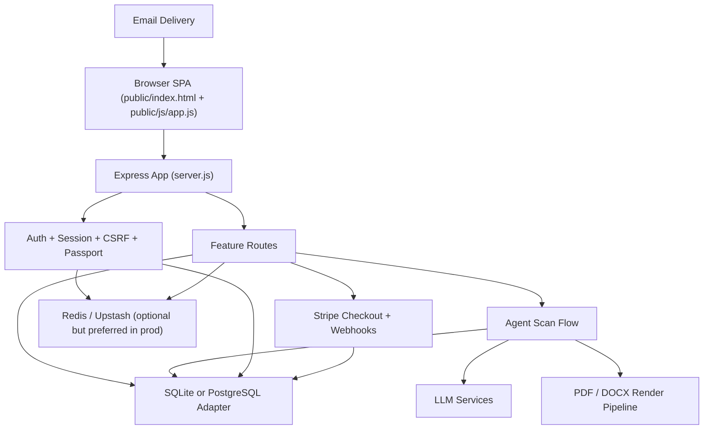
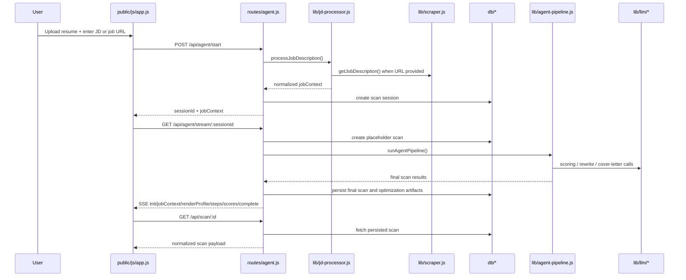

# ResumeXray Technical Documentation

This document is the engineering reference for the current ResumeXray codebase. It is written against the active SPA-plus-Express architecture in this repository and is intended to explain:

- what the product does end to end
- how requests move through the system
- how frontend, backend, AI, rendering, persistence, billing, and security layers connect
- which files own which concerns
- which top-level functions and routes exist in the first-party codebase
- what operational constraints and current risks matter to maintainers

Scope note:

- This document covers the first-party source of truth in `server.js`, `config/`, `middleware/`, `routes/`, `lib/`, `db/`, `public/`, `tests/`, and the active deployment/configuration files.
- Generated assets in `dist/` are mentioned as deployment artifacts, not as the editable source of truth.
- Minified/vendor code such as `public/js/purify.min.js` is not line-annotated here because it is not authored project logic.

## 1. Product Purpose

ResumeXray is an ATS-oriented resume workflow product. The core promise is:

1. User uploads an existing resume.
2. User supplies either a job description or a job URL.
3. The server resolves job context, including company, job title, job text, and ATS portal when possible.
4. The analysis pipeline parses the resume, evaluates ATS structure and keyword fit, and generates optimization artifacts.
5. The user previews ATS-oriented outputs before paying.
6. Credits are consumed only when exporting the final resume or cover letter.

The product supports two major usage modes:

- `Guest mode`
  Preview-focused, limited daily scans, token-gated access to scan results and previews.
- `Authenticated mode`
  Saved history, dashboard/profile, credit-backed exports, OAuth or email/password access.

## 2. Current Source Of Truth

The repository currently has one active frontend and one active backend.

### Active frontend

- `/Users/ghasmir/Documents/agents/ats-resume-checker/public/index.html`
- `/Users/ghasmir/Documents/agents/ats-resume-checker/public/js/app.js`
- `/Users/ghasmir/Documents/agents/ats-resume-checker/public/js/modules/ui-helpers.mjs`
- `/Users/ghasmir/Documents/agents/ats-resume-checker/public/js/modules/pdf-preview.mjs`
- `/Users/ghasmir/Documents/agents/ats-resume-checker/public/css/styles.css`
- `/Users/ghasmir/Documents/agents/ats-resume-checker/public/css/app-surfaces.css`

### Active backend

- `/Users/ghasmir/Documents/agents/ats-resume-checker/server.js`
- routes in `/Users/ghasmir/Documents/agents/ats-resume-checker/routes`
- business logic in `/Users/ghasmir/Documents/agents/ats-resume-checker/lib`
- persistence adapters in `/Users/ghasmir/Documents/agents/ats-resume-checker/db`

There is no second active frontend build pipeline anymore.

## 3. Runtime Architecture

## 4. Boot Sequence

The application boots in this order:

1. `server.js` loads environment variables with `dotenv`.
2. Sentry is initialized early through `lib/error-tracker.js`.
3. Express is created.
4. Trust proxy is enabled.
5. Database adapter is selected and initialized.
6. Graceful-shutdown handlers are registered.
7. Request ID, logging, Server-Timing, and shutdown-guard middleware are mounted.
8. CSP nonce middleware and helmet/security middleware are attached.
9. Compression and body parsers are mounted.
10. Session store is configured using SQLite or PostgreSQL.
11. Passport is configured and session middleware is enabled.
12. Static file serving from `public/` is attached.
13. CSRF token route is mounted.
14. CSRF protection middleware is mounted for state-changing routes.
15. Feature routes are mounted: auth, api, ai, agent, billing, user.
16. Health endpoints and error-report endpoints are mounted.
17. SPA catch-all serves `public/index.html` for app routes.

## 5. End-To-End User Flows

### 5.1 Guest or user opens the app

1. `server.js` serves `public/index.html`.
2. `public/js/app.js` loads the shared frontend modules from `public/js/modules/`.
3. On `DOMContentLoaded`, the SPA waits for those module imports before booting the UI.
4. `fetchUser()` requests `/user/me`.
5. The SPA router initializes and navigates based on current path and auth state.

### 5.2 User authentication

1. Frontend submits login/signup forms to `/auth/*`.
2. `routes/auth.js` validates, rate-limits, updates session, and claims guest scans when relevant.
3. `config/passport.js` handles OAuth strategies and session serialization.
4. Frontend calls `fetchUser()` again and rerenders nav/dashboard/profile state.

### 5.3 User runs a scan

### 5.4 User previews export

1. Frontend switches to Export Preview tab.
2. `reloadPdfPreview()` delegates preview state/control work to `public/js/modules/pdf-preview.mjs` and fetches `/api/agent/preview/:scanId`.
3. `routes/agent.js` calls `renderResumePdf()` in `lib/render-service.js`.
4. `renderResumePdf()` chooses the resume text source, ATS profile, template, and density, then calls `generatePDF()` in `lib/resume-builder.js`.
5. The backend returns a PDF buffer.
6. Frontend converts the PDF response to a blob URL and loads it into the iframe.

Current results-tab contract:

- The canonical tab order is `ATS Diagnosis -> Recruiter View -> Export Preview -> Cover Letter`.
- By explicit product decision, `Export Preview` remains third and `Cover Letter` remains fourth.
- Any future tab reorder must update button order, pane order, `switchTab()` defaults, and `resumeXray_activeTab` persistence together.

### 5.5 User exports

1. Frontend calls `/api/agent/download/:scanId?format=pdf|docx`.
2. `middleware/usage.js` enforces export credit requirements.
3. Backend renders the export and deducts credit atomically.
4. File downloads to the client.

## 6. Directory-Level Structure

### Root

- `server.js`
  Express application bootstrap and runtime wiring.
- `package.json`
  Scripts, dependencies, tooling commands.
- `README.md`
  Operator and developer overview.
- `FRONTEND_ARCHITECTURE.md`
  Frontend source-of-truth guidance.
- `docs/project_history.md`
  Project ledger/history.
- `docs/TECHNICAL_DOCUMENTATION.md`
  This document.
- `railway.json`
  Railway build/deploy entrypoint.
- `ecosystem.config.js`
  PM2 cluster/runtime config.
- `Caddyfile`, `infra/`, `deploy/`
  Infrastructure and deployment assets.

### `config/`

- Authentication, security/CSP/rate limiting, Stripe configuration.

### `middleware/`

- Auth gates, CSRF, uploads, usage/credit limits.

### `routes/`

- HTTP API surface grouped by feature.

### `lib/`

- Business logic and internal services:
  parser, analyzer, sections, xray, keywords, job context processing, LLM prompts/services, rendering, Redis, logging, error tracking, mailer.

### `db/`

- SQLite adapter
- PostgreSQL adapter
- schemas
- migrations
- seeds

### `public/`

- SPA shell, styles, client runtime, metadata/static assets.

### `tests/`

- Smoke tests, core flow tests, PDF/debug/manual test helpers.

## 7. Detailed Server Architecture

## 7.1 `server.js`

Responsibilities:

- environment load
- early Sentry init
- Express app creation
- security and middleware chain
- session store selection
- Passport session support
- static serving
- health and diagnostics endpoints
- route mounting
- SPA shell serving
- graceful shutdown

Important middleware layers in order:

1. request ID assignment
2. request logging
3. Server-Timing
4. shutdown guard
5. CSP nonce creation
6. helmet/security headers
7. permissions and clickjacking protection
8. general rate limiter
9. compression
10. Stripe raw-body webhook route
11. JSON/urlencoded parsers
12. session middleware
13. absolute session timeout middleware
14. Passport initialize/session
15. static serving
16. CSRF token route
17. CSRF protection
18. feature routes
19. health/metrics endpoints
20. CSP/client error sinks
21. SPA catch-all
22. centralized error handler

Primary top-level functions:

- `gracefulShutdown(signal)`
  Drains HTTP traffic, closes browser/Redis/db, and exits cleanly.
- `renderSpaShell(req, res, options)`
  Returns the SPA HTML shell for frontend routes.

## 7.2 Configuration Modules

### `config/passport.js`

Owns Passport strategy wiring and user session serialization.

Key behavior:

- configures Google, GitHub, and LinkedIn OAuth
- serializes only user ID into session
- deserializes users through db adapter
- supports account linking logic

Top-level function:

- `configurePassport()`

### `config/security.js`

Owns:

- helmet CSP
- permissions policy
- clickjacking headers
- Redis-backed or memory-backed rate limiters
- text sanitization helper

Key functions:

- `cspNonceMiddleware(req, res, next)`
- `configureHelmet()`
- `clickjackingProtection(req, res, next)`
- `permissionsPolicyMiddleware(req, res, next)`
- `buildRateLimitStore(prefix)`
- `keyByUserOrIp(req)`
- `makeLimiter(...)`
- `sanitizeInput(text)`

Important exports:

- `generalLimiter`, `authLimiter`, `apiLimiter`, `aiLimiter`, `agentLimiter`, `downloadLimiter`

### `config/stripe.js`

Owns Stripe client initialization and checkout session creation.

Key functions:

- `getStripe()`
- `createCheckoutSession(userId, email, packId)`

## 8. Middleware Layer

### `middleware/auth.js`

Auth and tier gates:

- `isAuthenticated`
- `isPro`
- `isExpert`
- `optionalAuth`

### `middleware/csrf.js`

Synchronizer-token CSRF protection.

Functions:

- `generateCsrfToken(req)`
- `getCsrfToken(req)`
- `csrfProtection(req, res, next)`

### `middleware/upload.js`

Multer configuration and upload-file validation.

Functions:

- `validateMagicBytes(buffer, mimetype)`

Exports:

- `upload`
- `ALLOWED_TYPES`
- `MAX_SIZE`

### `middleware/usage.js`

Usage gates for scans, AI features, and exports.

Functions:

- `checkScanLimit`
- `checkAiCredit`
- `checkExportCredit`
- `checkResumeLimit`

## 9. HTTP Route Surface

## 9.1 `routes/auth.js`

Responsibilities:

- signup
- login
- logout
- OAuth start/callback
- email verification
- resend verification
- forgot/reset password
- account linking
- login lockout state

Supporting functions:

- `checkLockout`
- `checkLockoutState`
- `recordFailedLogin`
- `recordFailedLoginState`
- `clearLoginAttempts`
- `clearLoginAttemptsState`
- `oauthCallbackHandler`

Primary endpoints:

- `POST /auth/signup`
- `POST /auth/login`
- `GET /auth/google`
- `GET /auth/github`
- `GET /auth/linkedin`
- `POST /auth/logout`
- `GET /auth/verify/:token`
- `POST /auth/resend-verification`
- `POST /auth/forgot-password`
- `POST /auth/reset-password`
- `POST /auth/link-account`

## 9.2 `routes/user.js`

Responsibilities:

- current user payload
- dashboard data
- credit history
- password update
- avatar update
- account deletion

Functions:

- `detectImageType(buffer)`

Endpoints:

- `GET /user/me`
- `GET /user/dashboard`
- `GET /user/credit-history`
- `PUT /user/password`
- `PUT /user/avatar`
- `DELETE /user/account`

## 9.3 `routes/billing.js`

Responsibilities:

- credit pack catalog
- current credits
- Stripe checkout
- Stripe webhook processing

Endpoints:

- `GET /billing/packs`
- `GET /billing/credits`
- `POST /billing/checkout`
- `POST /billing/webhook`

## 9.4 `routes/api.js`

Legacy/simple API endpoints outside the SSE agent workspace.

Endpoints:

- `POST /api/analyze`
- `GET /api/scan/:id`
- `POST /api/fix-bullet`

## 9.5 `routes/ai.js`

Feature endpoints for AI helpers.

Endpoints:

- `POST /ai/rewrite-bullet`
- `POST /ai/cover-letter`
- `POST /ai/interview-prep`
- `POST /ai/linkedin`

## 9.6 `routes/agent.js`

This is the core product route module.

Responsibilities:

- preflight job context resolution
- scan session creation
- SSE orchestration
- preview generation
- cover-letter preview
- download/export

Supporting functions:

- `parseScanId(raw)`
- `sendEmbeddedState(res, statusCode, payload)`
- `readJobContext(rawJobContext, fallback)`
- `buildSessionJobContext(dbSession)`
- `jobContextNeedsManualPaste(jobContext)`

Endpoints:

- `GET /api/agent/job-context`
  Resolves URL-derived or pasted-JD-derived `jobContext` before starting a scan.
- `POST /api/agent/start`
  Accepts upload + JD/link, creates a scan session, returns `sessionId` and `jobContext`.
- `GET /api/agent/stream/:sessionId`
  Runs the live analysis via SSE and persists placeholder/final scan state.
- `GET /api/agent/preview/:scanId`
  Returns inline preview PDF.
- `GET /api/agent/cover-letter-preview/:scanId`
  Returns preview HTML/PDF-ish cover-letter view.
- `GET /api/agent/download/:scanId`
  Generates downloadable export and charges credit.

## 10. Analysis Pipeline

## 10.1 `lib/agent-pipeline.js`

This is the orchestration engine for a live scan.

Function:

- `runAgentPipeline(resumeText, jdText, emitter, options)`

High-level steps:

1. sanitize resume text for LLM use
2. detect sections
3. run X-ray parser simulation
4. analyze formatting
5. score ATS/readiness
6. extract and match keywords
7. generate recommendations
8. optionally rewrite bullets (stored independently, applied later to structured nodes, never flat text)
9. generate keyword plan
10. generate cover letter when JD exists
11. emit progress/tokens/scores to SSE
12. return final structured result bundle

## 10.2 Parsing, Sections, and Integrity

### `lib/parser.js`

Owns raw document parsing by file type.

Functions:

- `parseResume(buffer, mimetype)`
- `parsePDF(buffer)`
- `parseDOCX(buffer)`
- `parseTXT(buffer)`

Important behavior:

- `parsePDF(...)` now attempts a layout-aware extraction path before falling back to the legacy linear `pdf-parse` text stream.
- The layout-aware path groups page text into rows, splits rows into spans, detects two-column separation heuristically, and serializes content in this order:
  1. header-left
  2. header-right
  3. body left column
  4. body right column
- This materially reduces right-column leakage into left-column experience content on two-column resumes without introducing an external OCR dependency.

### `lib/sections.js`

Owns heuristic structural section detection and integrity checks.

Functions:

- `detectSections(resumeText)`
- `detectContactInfo(text)`
- `analyzeFormat(resumeText)`
- `extractSections(text)`
- `extractContactInfo(text)`
- `validateResumeIntegrity(resumeText, sectionData)`

### `lib/resume-validator.js`

- `validateResumeContent(text)`
  Rejects obviously invalid uploads or non-resume content.

## 10.3 ATS Simulation and Diagnostics

### `lib/xray.js`

Owns parser emulation and extracted fields.

Functions:

- `runXrayAnalysis(rawText)`
- `simulateLegacyParser(text)`
- `simulateStructuredParser(text)`

### `lib/format-doctor.js`

- `checkFormatIssues(rawText, parsedSections)`
  Reports formatting and ATS-readability issues.

### `lib/analyzer.js`

- `analyzeResume(resumeText, jdText = '')`
  Higher-level combined analysis path.

### `lib/scorer.js`

- `generateRecommendations(keywordResults, xrayData, formatIssues)`
  Produces prioritized recommendation text.

## 10.4 Keywords and Matching

### `lib/keywords.js`

Functions:

- `extractKeywords(text)`
- `matchKeywords(resumeKeywords, jdKeywords)`
- `tokenize(text)`
- `findMultiWordSkills(text)`
- `expandTerms(termSet)`
- `fuzzyMatch(term, termSet)`
- `categorize(term)`

These functions support:

- exact keyword extraction
- phrase handling
- fuzzy matching
- categorization for missing/matched keywords

## 10.5 Job Description and ATS Context

### `lib/jd-processor.js`

This module makes job context server-owned and normalized.

Functions:

- `toTitleCase(value)`
- `cleanSlug(value)`
- `serializeTemplateProfile(atsProfile)`
- `hydrateAtsProfile(profileLike)`
- `detectATS(jobUrl, jdText, scrapePlatform)`
- `extractCompanyFromUrl(jobUrl)`
- `extractTitleFromUrl(jobUrl)`
- `extractJobTitleFromText(jdText)`
- `extractCompanyFromText(jdText, jobTitle)`
- `fallbackHostname(jobUrl)`
- `classifyScrapeStatus(errorMessage)`
- `normalizeJobContext(jobContext)`
- `processJobDescription(jdInput, jobTitle, jobUrl)`

`processJobDescription()` is the key entry point. It:

1. accepts pasted JD and/or URL
2. calls `lib/scraper.js` when a URL is present
3. detects ATS platform
4. derives company and title from scraped content, JD text, URL, or hostname fallback
5. normalizes scrape status and template profile
6. returns canonical `jobContext`

### `lib/scraper.js`

Portal-specific job scraping logic.

Functions:

- `getJobDescription(input)`
- `getHeaders()`
- `scrapeWorkday(url)`
- `parseWorkdayResponse(data, jobReqId)`
- `scrapeGreenhouse(url)`
- `scrapeLever(url)`
- `scrapeLinkedIn(url)`
- `scrapeIndeed(url)`
- `scrapeNaukri(url)`
- `scrapeSmartRecruiters(url)`
- `scrapeGenericHTML(url)`
- `extractFromJsonLd(html)`
- `cleanText(text)`

## 11. LLM Layer

The LLM layer is split between prompts and the higher-level service/orchestration.

Important modules in this repo snapshot:

- prompt builders in `lib/llm/prompts/*`
- service wiring in `lib/llm/llm-service.js`

The current code references:

- premium/free model routing
- retries
- queueing
- humanization/de-fluff postprocessing
- streaming support for cover-letter and bullet flows

### `lib/llm/prompts/cover-letter.js`

Primary function:

- `buildCoverLetterPrompt(resumeText, jobDescription, jobContext)`

Purpose:

- forces the cover letter into a concise, professional format
- consumes resolved job context
- bans generic/fluffy opening phrases
- keeps output scoped to facts supported by the resume/JD

## 12. Rendering and Export Pipeline

## 12.1 `lib/render-service.js`

This module is the backend entry point for preview/export resume PDF generation.

Functions:

- `parseMaybeJson(value, fallback)`
- `resolveScanJobContext(scan)`
- `resolveRenderMeta(scan)`
- `getExpectedName(scan)`
- `buildStructuredResumeText(scan)`
- `resolveResumeText(scan)`
- `buildRenderAttempts(jobContext)`
- `renderResumePdf(scan, options)`

Important behavior:

- chooses optimized resume text first
- falls back to structured text rebuilt from extracted sections if needed
- selects ATS-aware template profile and fallback attempts
- validates the produced PDF before declaring it ready

## 12.2 `lib/resume-builder.js`

This module turns resume text into DOCX/PDF outputs.

Functions:

- `standardizeHeader(header)`
- `normalizeDates(text)`
- `sanitizeForATS(text)`
- `splitNonEmptyLines(text)`
- `looksLikeLocationLine(line)`
- `isLikelyContactLine(line)`
- `looksLikeContactBlock(text)`
- `extractHeadlineFromHeaderBlock(text)`
- `isLikelyNameLine(line)`
- `matchSectionHeader(line)`
- `extractHeaderFields(lines)`
- `looksLikeExperienceHeaderLine(line)`
- `buildResumeData(resumeText, sectionData, optimizedBullets, keywordPlan)`
- `polishProfessionalSummary(sections, options)`
- `applyBulletRewrites(sections, optimizedBullets)`
- `trimForSinglePage(sections, { isJunior, maxPages })`
- `stripPlaceholderMetrics(sections)`
- `parseSectionsAdvanced(text)`
- `calculateTenure(experienceLines)`
- `highlightMetricsInSections(sections)`
- `generateDOCX(...)`
- `generatePDF(...)`
- `renderHtmlToPdf(html)`
- `validatePDF(pdfBuffer, expectedNameOrOptions)`

Pipeline summary:

1. sanitize the original resume text for ATS-safe rendering
2. normalize dates and symbols on that original text
3. parse sections heuristically, including explicit header extraction and exact section-header matching
4. recover cleaner header/contact/summary fields and preserve concise honest source headlines when possible
5. highlight metrics and trim content toward the allowed page budget while the data is still in flat arrays
6. structure flat lines into nested template-friendly objects
7. apply optimized bullet rewrites directly to structured nodes, skipping any rewrite that already failed `contextAudit`
8. render the Handlebars HTML template or DOCX section content from those objects
9. use Playwright to generate PDF when PDF output is requested
10. validate text layer and page bounds

Template support:

- the live PDF pipeline now accepts `refined`, `modern`, `classic`, and `minimal`
- `refined` is not just a frontend-only preview option; it is wired end-to-end through request normalization, render-service attempt selection, and `generatePDF(...)`

Important limitation:

- This pipeline is substantially safer than the older flat-text string-replacement flow, but it is still heuristic.
- False role creation from wrapped comma-heavy bullet lines was materially reduced by the Apr 21 parser/render fix, but unusually malformed resumes can still stress the heuristic boundary.
- Dense tag-style skill sidebars still flatten into plain ATS-safe text rather than a fully semantic skill taxonomy.
- No database migration was required for this refactor; the work was a render-pipeline reordering and structuring change, not a schema rewrite.

Historical provenance:

- These render-pipeline decisions were consolidated during the April 2026 remediation cycle after a Codex audit, Gemini planning pass, and Claude Sonnet/Opus implementation refinement.
- The durable engineering outcome is what matters in this reference: keep bullet rewrites off flat text, avoid unnecessary schema migration for this class of fix, and treat malformed-source parsing as an active risk rather than a solved problem.

## 12.3 `lib/template-renderer.js`

This module compiles HTML templates and structures flat lines into template-friendly objects.

Functions:

- `loadBaseCss()`
- `getTemplate(name)`
- `detectPlatform(jobUrl)`
- `getPlatformHint(platform)`
- `renderTemplate(templateName, data, options)`
- `buildContactArray(contactString)`
- `isDateOnlyLine(line)`
- `normalizeDateLine(line)`
- `isLikelyRoleTitle(text)`
- `splitCompanyAndLocation(text)`
- `looksLikeCompanyText(text)`
- `isLikelyEntryHeader(line, nextLine)`
- `parseEntryHeader(line)`
- `structureExperience(lines)`
- `structureEducation(lines)`
- `structureSkills(lines)`
- `structureProjects(lines)`

Template source files:

- `lib/templates/base.css`
- `lib/templates/refined.html`
- `lib/templates/modern.html`
- `lib/templates/classic.html`
- `lib/templates/minimal.html`
- `lib/templates/cover-letter.html`

Important behavior:

- `structureExperience(...)` now strongly prefers real entry headers:
  - header line followed by a standalone date line, or
  - inline role/company patterns with spaced separators like `Title - Company`
- Once the renderer is inside bullets for a role, non-header lines are biased toward bullet continuation instead of being promoted into new fake roles.
- `structureEducation(...)` now groups multi-line degree/school text until the date line so wrapped education headers survive export cleanly.

## 12.4 `lib/cover-letter-parser.js`

Transforms raw generated cover-letter text into the structured data required by the cover-letter template.

Functions:

- `formatToday()`
- `splitContact(raw)`
- `stripClosing(body)`
- `stripGreeting(body)`
- `stripSubjectLine(body)`
- `guessHeaderFromText(text)`
- `parseCoverLetter(rawText, ctx)`

## 12.5 `lib/playwright-browser.js`

Shared Chromium lifecycle and render-slot coordination.

Functions:

- `getBrowser()`
- `closeBrowser()`
- `localAcquire()`
- `localRelease()`
- `acquireRenderSlot()`
- `releaseRenderSlot(leaseId)`
- `getRenderStats()`

Purpose:

- reuses a shared Chromium instance
- limits concurrent PDF renders
- uses Redis when available, local semaphore otherwise

## 13. Redis, Logging, Errors, and Email

### `lib/redis.js`

Functions:

- `degradeRedis(reason, err)`
- `getRedis()`
- `closeRedis()`
- `isRedisHealthy()`

Purpose:

- lazily initialize Redis
- use Upstash when configured
- degrade quickly to local behavior on connectivity problems

### `lib/logger.js`

Functions:

- `redactPII(meta)`
- `formatLog(level, message, meta)`
- `log(level, message, meta)`

Purpose:

- structured logging with PII redaction

### `lib/errors.js`

Error hierarchy:

- `AppError`
- `ValidationError`
- `AuthenticationError`
- `ForbiddenError`
- `NotFoundError`
- `ConflictError`
- `RateLimitError`
- `InsufficientCreditsError`
- `ExternalServiceError`
- `ProgrammerError`

### `lib/error-tracker.js`

Functions:

- `initSentryEarly()`
- `initSentry(app)`
- `captureError(error, context)`
- `flushSentry()`

### `lib/mailer.js`

Functions:

- `escapeHtml(str)`
- `createEmailTemplate(title, body, actionLabel, actionUrl)`
- `sendVerificationEmail(to, token)`
- `sendPasswordResetEmail(to, token)`
- `sendSSOLoginReminderEmail(to, provider)`

## 14. Database Layer

The repo uses an adapter pattern so SQLite and PostgreSQL expose the same application API.

### 14.1 `db/database.js`

SQLite adapter with migrations and all persistence methods.

Key categories of functions:

- user lifecycle
- verification/reset tokens
- tier/credits/transactions
- resumes and scans
- jobs and cover letters
- guest scan tracking
- scan sessions
- PII encryption helpers
- Stripe webhook idempotency

Important functions include:

- `getDb()`
- `runMigrations(database)`
- `findOrCreateUser(...)`
- `getUserById(id)`
- `getUserByEmail(email)`
- `createUser(...)`
- `verifyUser(userId)`
- `setVerificationToken(...)`
- `setResetToken(...)`
- `updatePassword(...)`
- `claimGuestScans(...)`
- `getCreditBalance(userId)`
- `addCredits(...)`
- `deductCredit(...)`
- `deductCreditAtomic(...)`
- `saveResume(...)`
- `saveScan(...)`
- `updateScan(...)`
- `updateScanWithOptimizations(...)`
- `getUserScans(userId, limit)`
- `getScan(id, userId, accessToken)`
- `getFullScan(scanId, userId, accessToken)`
- `recordGuestScan(ipAddress)`
- `createScanSession(sessionId, data)`
- `getScanSession(sessionId)`
- `deleteScanSession(sessionId)`
- `encryptPii(plaintext)`
- `decryptPii(ciphertext)`
- `isStripeEventProcessed(eventId)`
- `recordStripeEvent(...)`

### 14.2 `db/pg-database.js`

PostgreSQL adapter with interface parity to SQLite.

Additional helpers:

- `withTx(fn)`
- `queryOne(sql, params)`
- `queryAll(sql, params)`

It mirrors the same persistence surface as `db/database.js`.

### 14.3 Schemas and migrations

- `db/schema.sql`
  SQLite schema
- `db/pg-schema.sql`
  PostgreSQL schema
- `db/migrate-pii-encryption.js`
  encryption migration script
- `db/migrate-sqlite-to-pg.js`
  data migration utility
- `db/seed.js`
  local/dev seed data

## 15. Frontend Architecture

The frontend is a single-page application inside `public/index.html`, coordinated by `public/js/app.js`, with an initial native-ES-module extraction in `public/js/modules/` and styling split between the base system in `public/css/styles.css` and the newer premium app-surface layer in `public/css/app-surfaces.css`.

## 15.1 `public/index.html`

Defines:

- global layout shell
- top navigation
- mobile bottom sheet
- landing page sections
- auth views
- scan view
- results workspace
- dashboard/profile/pricing views
- footer
- cookie consent UI

Major view IDs:

- `view-landing`
- `view-signup`
- `view-login`
- `view-forgot-password`
- `view-reset-password`
- `view-verify`
- `view-profile`
- `view-scan`
- `view-results`
- `view-dashboard`
- `view-pricing`
- utility/legal views

Major results panes:

- `tab-diagnosis`
- `tab-recruiter-agent`
- `tab-pdf-preview`
- `tab-cover-letter`

Important results workspace substructures:

- `results-masthead`
  role-first workspace header with readiness and context pills
- `results-context-strip`
  integrated company / portal / source rail rendered inside the masthead copy area
- `results-summary-strip`
  top-priority, recruiter-visibility, and export-readiness cards
- `agent-recruiter-overview`
  recruiter field health counters for captured / partial / missing signals
- `agent-recruiter-rows`
  recruiter-facing field review grid rendered from structured parser output
- `agent-search-visibility`
  matched vs missing keyword signal panel for recruiter/search coverage

## 15.2 `public/js/app.js`

This file is the primary SPA orchestrator and boot/runtime shell. It handles:

- auth bootstrap
- router and page titles
- scan form behavior
- job-context probing
- SSE analysis flow
- results rendering
- dashboard/profile/pricing rendering
- preview/download helpers
- cover letter preview logic
- module bootstrapping for extracted frontend concerns
- cookie consent UI

Major function groups:

### Core utilities

- `clearPdfPreviewObjectUrl(previewFrame)`
- `debounce(fn, ms)`
- `uiIcon(name, options)`
- `announceToScreenReader(message, priority)`
- `fetchCsrfToken()`
- patched `window.fetch`
- `timeAgo(dateStr)`
- `scoreColor(score)`
- `scoreBadge(score, label)`
- `el(id)`
- `$(id)`
- `esc(str)`
- `decodeHtml(str)`
- `safeHtml(html)`
- `truncate(str, len)`
- `formatFileSize(bytes)`

### Extracted runtime modules

- `public/js/modules/ui-helpers.mjs`
  Owns shared DOM helpers, inline SVG icons, ARIA announcements, toast rendering, clipboard copy, escaping, HTML decoding, and DOMPurify-backed sanitization helpers.
- `public/js/modules/pdf-preview.mjs`
  Owns the PDF preview controller, shared preview state, focus-mode toggles, toolbar controls, blob-backed iframe loading, retry UI, and responsive preview sizing.

### Auth and routing

- `fetchUser()`
- `updateNavCredits(balance)`
- `showAuth(mode)`
- `setupRouter()`
- `getPageTitle(path)`
- `getRouteGroup(path)`
- `navigateTo(path, push)`
- `updateActiveNavLink(path)`
- `resetScanForm()`
- `_setupPasswordStrength(inputId, prefix)`
- `setupAuthForms()`
- `verifyEmail(token)`
- `setupGlobalDelegation()`
- `setupPasswordToggles()`
- `setupMobileMenu()`

### Tabs and preview controls

- `switchTab(tabId)`
- `setupPdfPreviewControls()`
- `setPdfPreviewMode(mode)`
- `setPdfPreviewFocusMode(active)`
- `setupResultsTabs()`
- `reloadPdfPreview(scanId)`
- `downloadOptimized(format)`
- `downloadCoverLetter(format)`

### Job context and scan intake

- `extractCompanyFromUrl(urlStr)`
- `capitalize(str)`
- `getJobContext(scanOrContext)`
- `getJobSourceLabel(jobContext)`
- `getJobStatusTone(jobContext)`
- `renderJobLinkStatus(jobContext, options)`
- `renderScanLoadingContext(jobContext)`
- `updateResultsContextStrip(scanOrContext)`
- `updateResultsWorkflowHints(scanOrContext)`
- `setupCompanyDetection()`
- `setupFileUpload()`
- `setupAgentResults()`
- `startAgentAnalysis(sessionId, initialJobContext)`

### Live results and SSE handling

- `updateAgentProgress(stepNum, status)`
- `addAgentStepCard(step, name, label)`
- `updateAgentStepCard(step, status, label, data)`
- `typewriterToken(step, chunk, bulletIndex)`
- `renderAgentBullet(data)`
- `updateAgentScores(scores)`
- `updateResultsSummary({ scores, scan })`
- `updateResultsWorkspaceHeader({ scan, source })`
- `finalizeAgentUI(data)`

### Historical results and dashboard/profile rendering

- `loadResults(scanId, retryCount)`
- `setupAgentHistoricalView(data)`
- `renderAgentHistoricalTimeline(data)`
- `renderDashboard()`
- `updateDashboardFocus(data, user)`
- `updateDashboardJourney(data, user)`
- `setJourneyItemState(id, state)`
- `getDashboardRecommendation(...)`
- `getDashboardScanTitle(scan)`
- `renderProfile()`
- `updateProfileGuidance(user, creditBalance)`
- `updateProfileMomentum(user, creditBalance)`
- `renderPricing()`

### Recruiter view and bullet fixing

- `normalizeRecruiterFieldValue(value)`
- `formatRecruiterFieldName(fieldName)`
- `getRecruiterFieldEntries(fieldAccuracy, extractedFields)`
- `summarizeRecruiterField(fieldName, rawValue)`
- `buildRecruiterRows(fieldAccuracy, extractedFields)`
- `buildRecruiterOverview(fieldAccuracy, extractedFields)`
- `renderSearchVisibilitySummary(keywordData)`
- `renderRecruiterVisibility(xrayData, keywordData)`
- `fixBullet(btn)`
- `applyFixMetric(fixIndex)`

### Notifications and supporting state

- `showToast(message, type, options)`
- `announceToScreenReader(message, type)` (toast/log variant)
- `addToNotificationLog(message, type)`
- `dismissToast(toast)`
- `copyToClipboard(text, btn)`
- `currentScanTokenQuery()`
- `getActiveScanId()`
- `scanHasTargetJob(scan, jobContext)`
- `persistCurrentScanToken(token)`
- `getPersistedCurrentScanToken()`
- `buildScanApiUrl(scanId)`
- `startCheckout(packId)`
- `animateCountUp(element, target, duration)`
- `renderCoverLetter(text)`

## 15.3 `public/css/styles.css`

This is the active stylesheet for:

- design tokens
- layout system
- landing pages
- auth
- scan
- results
- dashboard/profile
- pricing
- footer
- cookie banner
- responsive behavior

The file is still monolithic, though some app-surface separation work has started elsewhere.

## 15.4 `public/css/app-surfaces.css`

This stylesheet contains newer premium-surface overrides and component-level styling for:

- results masthead and context rail
- recruiter visibility banner, counters, review cards, and keyword signal panel
- profile momentum surfaces
- PDF focus-view overlays and toolbar refinements
- other newer app-surface components that intentionally sit above the older base stylesheet

The active results workspace now depends on both CSS files:

- `styles.css` for tokens, layout primitives, shared component classes, and legacy responsive rules
- `app-surfaces.css` for higher-level visual hierarchy and premium surface presentation

## 16. Frontend/Backend Contracts

Important contracts currently in play:

- `/user/me`
  determines initial auth state
- `/api/csrf-token`
  initializes state-changing request protection
- `/api/agent/job-context`
  powers live URL portal/company/JD detection before scan start
- `/api/agent/start`
  returns `sessionId`, credit balance, and normalized `jobContext`
- `/api/agent/stream/:sessionId`
  emits SSE events:
  - `init`
  - `jobContext`
  - `renderProfile`
  - `step`
  - `token`
  - `bullet`
  - `scores`
  - `coverLetter`
  - `atsProfile`
  - `complete`
  - `error`
- `/api/scan/:id`
  returns persisted scan payload used by results/dashboard/history
- `/api/agent/preview/:scanId`
  returns preview PDF
- `/api/agent/cover-letter-preview/:scanId`
  returns cover-letter preview content
- `/api/agent/download/:scanId`
  returns downloadable export and consumes credits

## 17. Billing and Credits

Credit behavior:

- scans and previews are free
- exports cost credits
- Stripe checkout sells one-time credit packs
- webhook fulfillment updates balances
- atomic deduction logic prevents double charging

Relevant modules:

- `config/stripe.js`
- `routes/billing.js`
- `db/database.js`
- `db/pg-database.js`
- `middleware/usage.js`

## 18. Deployment and Operations

### Railway

- `railway.json`
  starts with `node server.js`
  healthchecks `/healthz`

### VPS / PM2 / Caddy path

- `ecosystem.config.js`
  PM2 cluster configuration
- `Caddyfile`
  reverse proxy/TLS
- `deploy/`
  shell-based provisioning and deploy scripts
- `infra/`
  infrastructure helpers

Important operational nuance:

- the repo supports both a Railway-style direct Node deploy and a PM2/Caddy production topology
- Redis is preferred in clustered deployments for shared rate-limiting and render-slot coordination

Budget-hosting guidance recorded during the April 2026 remediation planning:

- Playwright browser rendering, native modules such as `better-sqlite3`, and local temp-file behavior make serverless/edge-style hosts a poor fit for the full app.
- If the project moves away from Railway, the low-cost path preserved in the remediation planning is an Ubuntu-based VPS flow, with Oracle Cloud A1 identified as the most credible sub-$10/year option.
- The existing Alpine-based Dockerfile should not be treated as the Oracle/Playwright deployment path; the browser dependency story there differs from Railway's Nixpacks-based runtime.

### Local environment recovery notes

- `better-sqlite3` is a native dependency. If the local Node ABI changes, the fastest recovery path is `npm rebuild better-sqlite3`.
- This recovery path was re-verified on 2026-04-17: after rebuilding `better-sqlite3`, the default `npm test` suite returned to green without needing a lockfile reset or full reinstall.
- For clean local boot verification, setting `UPSTASH_REDIS_URL=` forces the app onto the documented in-memory fallback path and avoids requiring a live Upstash connection during startup.
- Phase 2 frontend modularization was also verified on 2026-04-17 with `npm run syntax:frontend`, `npm test`, a clean local boot, and a browser smoke that confirmed the SPA initialized after the new dynamic imports loaded.

## 19. Test Strategy

### Automated tests currently in the main npm test path

- `tests/smoke.test.js`
  server boot, health endpoints, SPA routes, security headers
- `tests/core-flow.test.js`
  ATS detection, structured fallback text, normalized job context, readable PDF preview

### Additional manual/debug scripts

- `tests/test-pdf-live.js`
- `tests/test-pdf.js`
- `tests/test-pdf-debug.js`
- `tests/test-builder.js`
- `tests/test-integrity.js`
- `tests/test-analyzer.js`
- `tests/test-watermark.js`
- `tests/test-bug.js`
- `tests/test-parse-debug.js`
- `tests/test-typst.js`

These are useful for focused debugging but are not all in the default CI test command.

## 20. Current Known Risks and Maintenance Notes

1. `public/js/app.js` is still large even after the initial extraction of shared UI helpers and PDF preview logic into `public/js/modules/*`.
2. `public/css/styles.css` is still monolithic, even though `public/css/app-surfaces.css` now carries part of the newer app-surface layer.
3. Resume PDF quality is improved but still sensitive to malformed or poorly structured source resumes.
4. Cover-letter quality is materially better but still dependent on upstream LLM/provider behavior.
5. Dual deployment stories exist in repo docs and config; maintainers must be clear which target is authoritative in a given environment.
6. Redis is optional in local/dev but strongly preferred in clustered production.
7. When `UPSTASH_REDIS_URL` is configured locally, the Redis-backed rate limiter store can emit transient startup promise rejections before the connection settles; the clean local verification path currently blanks that variable and uses the in-memory fallback instead.

## 21. File Inventory Appendix

This appendix lists the first-party code and config files that matter to maintainers.

### Core runtime

- `server.js`
- `package.json`
- `README.md`
- `FRONTEND_ARCHITECTURE.md`
- `docs/project_history.md`
- `docs/TECHNICAL_DOCUMENTATION.md`

### Config

- `config/passport.js`
- `config/security.js`
- `config/stripe.js`

### Middleware

- `middleware/auth.js`
- `middleware/csrf.js`
- `middleware/upload.js`
- `middleware/usage.js`

### Routes

- `routes/agent.js`
- `routes/ai.js`
- `routes/api.js`
- `routes/auth.js`
- `routes/billing.js`
- `routes/user.js`

### Business logic

- `lib/agent-pipeline.js`
- `lib/analyzer.js`
- `lib/cover-letter-parser.js`
- `lib/error-tracker.js`
- `lib/errors.js`
- `lib/format-doctor.js`
- `lib/jd-processor.js`
- `lib/keywords.js`
- `lib/logger.js`
- `lib/mailer.js`
- `lib/parser.js`
- `lib/playwright-browser.js`
- `lib/redis.js`
- `lib/render-service.js`
- `lib/resume-builder.js`
- `lib/resume-validator.js`
- `lib/scorer.js`
- `lib/scraper.js`
- `lib/sections.js`
- `lib/template-renderer.js`
- `lib/validation.js`
- `lib/xray.js`

### Template assets

- `lib/templates/base.css`
- `lib/templates/modern.html`
- `lib/templates/classic.html`
- `lib/templates/minimal.html`
- `lib/templates/cover-letter.html`

### Database

- `db/database.js`
- `db/pg-database.js`
- `db/schema.sql`
- `db/pg-schema.sql`
- `db/seed.js`
- `db/migrate-pii-encryption.js`
- `db/migrate-sqlite-to-pg.js`

### Frontend

- `public/index.html`
- `public/js/app.js`
- `public/css/styles.css`
- `public/css/app-surfaces.css`
- `public/robots.txt`
- `public/sitemap.xml`
- `public/offline.html`
- `public/llms.txt`

### Tests

- `tests/smoke.test.js`
- `tests/core-flow.test.js`
- `tests/test-analyzer.js`
- `tests/test-bug.js`
- `tests/test-builder.js`
- `tests/test-integrity.js`
- `tests/test-parse-debug.js`
- `tests/test-pdf-debug.js`
- `tests/test-pdf-live.js`
- `tests/test-pdf.js`
- `tests/test-typst.js`
- `tests/test-watermark.js`

### Deployment and infrastructure

- `railway.json`
- `ecosystem.config.js`
- `Caddyfile`
- `deploy/*`
- `infra/*`

## 22. Maintenance Rule

When behavior changes in:

- route contracts
- scan flow
- render pipeline
- auth/session behavior
- billing/credits
- deployment target

then both of these docs should be updated in the same change:

- `docs/project_history.md`
- `docs/TECHNICAL_DOCUMENTATION.md`

## 23. April 19 2026 Remediation Addendum

This section captures the trust-breaking scan/results remediation completed after the multi-model planning pass.

### 23.1 Scan Input Contract

The scan form now treats resume upload and job targeting more strictly:

- Resume uploads are limited to `PDF` and `DOCX`.
- The frontend picker, upload middleware, parser path, and validation copy all reflect the same contract.
- Pasted job descriptions and job-link fetch mode are now mutually exclusive in the UI:
  - pasted JD locks the URL field
  - a successfully resolved job link locks the JD textarea
- Locked inputs receive visible disabled styling so the user understands which targeting mode is currently active.

### 23.2 Resume Validation Hardening

`lib/resume-validator.js` was strengthened to reduce false acceptance of arbitrary documents:

- positive signals now include:
  - email / phone / profile links
  - section headers
  - resume-like date ranges
  - bullet density
  - professional action keywords
- negative signals now subtract confidence for document classes like:
  - invoices
  - contracts
  - proposals
  - privacy / terms documents
- a file must now show both contact evidence and structural resume evidence before it is accepted as a resume

### 23.3 Job Context / Scraper Improvements

`lib/jd-processor.js` and `lib/scraper.js` were expanded so job titles and companies are derived more safely:

- added explicit ATS profiles for:
  - `Indeed`
  - `Cezanne HR`
- title extraction no longer accepts long sentence fragments as role titles
- aggregator / portal hostnames are no longer used as the company fallback when they are obviously not the employer
- scraper output is normalized into:
  - `text`
  - `platform`
  - `metadata.title`
  - `metadata.company`
  - `metadata.location`
- generic HTML scrapes now prepend DOM-derived metadata before downstream job-context parsing

Net effect:

- recruiter/history surfaces are less likely to show:
  - raw domains
  - sentence fragments
  - portal names as employer names

### 23.4 Keyword Extraction Guardrails

`lib/keywords.js` was updated to stop emitting noisy single-letter / ambiguous programming terms:

- raw unconditional `go` and `r` dictionary matches were removed
- contextual detection was added for:
  - `golang`
  - `go language`
  - `go microservices`
  - `R programming`
  - `RStudio`
  - `tidyverse`
- recruiter-view keyword rendering in `public/js/app.js` also filters one-letter / ambiguous tags defensively

This specifically fixes the recruiter-view failure where non-programming JDs were surfacing missing `go` / `r`.

### 23.5 Resume Structuring / Template Safety

The document pipeline was already reordered earlier in the remediation to avoid destructive flat-text replacement. This pass further tightened the remaining heuristic structuring risk:

- `lib/template-renderer.js`
  - rejects lowercase / sentence-like lines as job headers
  - detects wrapped bullet continuations
  - keeps wrapped skill/tool fragments attached to the current bullet instead of splitting them into fake experience entries

This does **not** mean resume generation is perfect; it means one major class of malformed output is now covered by both code and regression tests.

### 23.6 Results / Preview UI

The results workspace was updated in the following ways:

- tab order remains:
  - `ATS Diagnosis`
  - `Recruiter View`
  - `Export Preview`
  - `Cover Letter`
- the tab chrome was visually softened to reduce shell noise
- projected score is now rendered consistently whenever a match score exists
- Export Preview now exposes ATS-safe format switching:
  - `modern`
  - `classic`
  - `minimal`
- selected template state is carried through:
  - inline preview requests
  - full preview URLs
  - download requests
- the PDF preview iframe sandbox restriction was removed from the blob-backed preview path to improve inline rendering reliability

### 23.7 Dashboard Simplification

The dashboard was simplified to reduce confusion:

- removed the extra `journey` / `recent signal` layer
- kept the page focused on:
  - next action
  - latest scan
  - targeted scan count
  - credits
  - recent history
- dashboard/history titles are now sanitized so noisy titles fall back to cleaner role/company labels

### 23.8 Database Reset and Seeding

Both data stores were deliberately reset during this remediation.

#### Local SQLite

- reset via `npm run db:reset`
- local seed data now includes fresh users plus representative resume / scan / job fixtures

#### Supabase / PostgreSQL

- application tables were truncated and identities reset
- a new dedicated seed script was added:
  - `db/seed-pg.js`
- this script recreates:
  - demo users
  - resume data
  - saved jobs
  - scan history
  - cover-letter fixtures

Fresh accounts restored:

- `demo@resumexray.pro / demo1234`
- `pro@resumexray.pro / pro12345`
- `hustler@resumexray.pro / pro12345`

### 23.9 Verification Snapshot

Completed after the remediation and reset:

- `npm run syntax:frontend`
- targeted `node -c` validation on modified backend files
- `npm test` passing at `24/24`
- local browser verification on `http://localhost:3367`

Verified in browser:

- dashboard no longer renders the removed journey grid
- pasted JD mode disables the URL field
- scan-page job-link status reflects pasted-JD mode correctly
- Export Preview format switching activates and changes preview request URLs
- projected score card stays visible once a match score exists

### 23.10 Remaining Caveats

- third-party job sites can still change their markup or anti-bot behavior without notice
- resume generation is materially safer than before but still not yet "premium-perfect" on every malformed source file
- `public/js/app.js` and `public/css/styles.css` remain large and should continue to be modularized after the current trust-critical fixes

### 23.11 April 20 Frontend Refinement Follow-up

This follow-up pass focused on UI polish and cleanup after the larger Apr 19 remediation landed.

Changes shipped:

- refined the results tab bar so it behaves like a cleaner workspace control:
  - grid-based layout
  - calmer shell treatment
  - improved icon/text alignment
  - tighter active-state hierarchy
- preserved the user-approved tab order:
  - `ATS Diagnosis`
  - `Recruiter View`
  - `Export Preview`
  - `Cover Letter`
- shortened tab helper copy to utility labels:
  - `Rules & gaps`
  - `Search fields`
  - `PDF + DOCX`
  - `Targeted draft`
- increased left padding in the job URL input so the inline link icon no longer crowds placeholder text
- removed the stale `updateDashboardJourney(...)` dashboard invocation after the journey panel markup had already been deleted

Verification after this follow-up:

- `npm run syntax:frontend` passed
- `npm test` passed fully (`24/24`)
- local boot remained healthy on the non-Redis fallback path used for verification

### 23.12 April 20 Resume Export Formatting and Page-Budget Update

This pass addressed the actual exported resume quality rather than only the surrounding UI.

Changes shipped:

- tightened the shared PDF template foundation in `lib/templates/base.css`:
  - smaller vertical rhythm
  - better bullet indentation
  - improved title / company / date alignment
  - less wasteful margins and spacing
- added section-specific hooks in:
  - `lib/templates/modern.html`
  - `lib/templates/classic.html`
  - `lib/templates/minimal.html`
  so the render pipeline can selectively tighten or trim low-priority content when the export overflows
- updated `lib/resume-builder.js` so the export budget is now experience-aware:
  - `maxPages = 1` when effective experience is `<= 3 years`
  - `maxPages = 2` when effective experience is `> 3 years`
- changed the PDF fit logic from a blanket one-page target to an allowed-page-budget model
- corrected the fit-height calculation to use printable content height rather than full sheet height
- added a PDF-only compaction pass that progressively:
  - applies compact density classes
  - trims summary length
  - reduces older-role bullet counts
  - removes low-priority sections only if necessary for the current page budget

Missing-skill handling was also improved:

- `keywordPlan` is no longer only diagnostic metadata
- honest `Skills` suggestions are now merged conservatively into the built resume data
- honest `Summary` suggestions can be appended when they are non-duplicative
- suggestions with `honest: false` are explicitly ignored

Verification after this pass:

- `npm test` passed fully (`26/26`)
- regression tests now cover:
  - honest keyword-plan skill injection
  - experienced-resume two-page budgeting
  - one-page PDF validation for an early-career modern-template resume
- artifact validation confirmed a dense early-career sample rendered successfully as:
  - `template: modern`
  - `density: standard`
  - `pageCount: 1`

### 23.13 April 21 Export Quality and Template Policy Update

This pass shifted the export strategy away from early aggressive shrinking and toward preserving quality first, then tightening only when necessary.

Changes shipped:

- added a new ATS-safe template:
  - `lib/templates/refined.html`
- expanded the allowed template set so it now includes:
  - `refined`
  - `modern`
  - `classic`
  - `minimal`
- updated the Export Preview toolbar in `public/index.html` and the selector logic in `public/js/app.js` so users can explicitly choose the new `refined` template
- changed ATS template defaults in `lib/jd-processor.js`:
  - generic default now prefers `refined`
  - several ATS profiles that previously defaulted to `minimal` / `compact` now prefer `refined` or `classic` at `standard` density
- reordered render fallback behavior in `lib/render-service.js` so preview/export attempts now prioritize:
  - the resolved ATS profile
  - standard-density quality fallbacks (`refined`, `classic`)
  - compact fallback only after those higher-quality attempts
  - `minimal` remains the strict fallback, but no longer starts from `compact` by default
- added `polishProfessionalSummary(...)` in `lib/resume-builder.js`
  - normalizes weak first-person / filler-heavy summaries
  - builds a deterministic fallback summary when the parsed summary is weak or missing
  - injects role / years-experience / skill context so the resume header section reads more like a professional finished document

Practical product effect:

- the system now tries to keep the resume readable and professional before shrinking typography
- export previews have a stronger default presentation
- the summary block is less dependent on the quality of the raw uploaded resume text

Validation completed for this pass:

- `node --check public/js/app.js`
- `node --check lib/jd-processor.js`
- `node --check lib/render-service.js`
- `node --check lib/resume-builder.js`
- `npm test -- --runInBand tests/core-flow.test.js`
